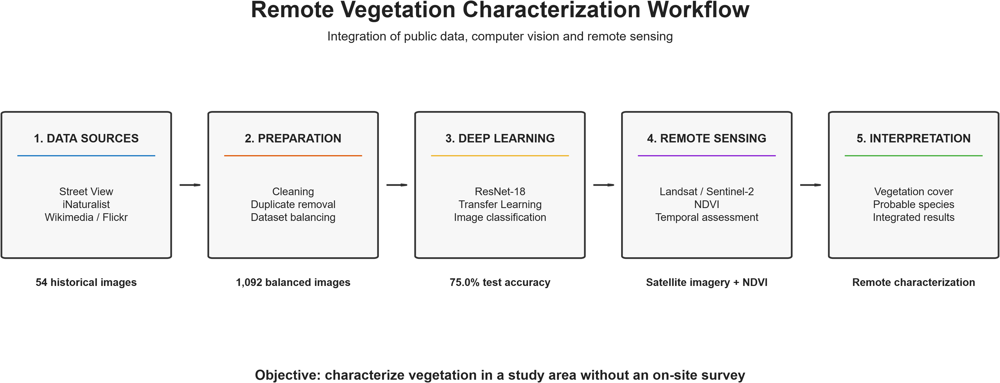
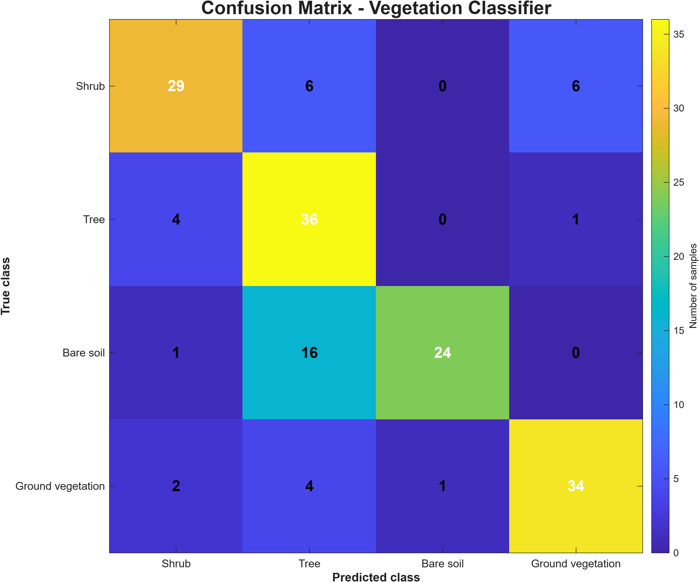

# Remote Vegetation Classification with Deep Learning

Academic project developed to remotely characterize vegetation in a study area where an on-site survey was not available.

The solution integrates computer vision, public data sources, historical imagery and remote sensing to estimate vegetation cover and identify probable species.

## Challenge

The main challenge was to characterize the vegetation of the study area entirely remotely, using limited academic resources and existing public data sources.

## Approach

- Dataset construction using public APIs and image sources
- Image cleaning, duplicate removal and class balancing
- Vegetation classification using ResNet-18 and Transfer Learning
- Historical imagery analysis
- Sentinel-2 satellite imagery processing
- NDVI calculation for vegetation coverage assessment
- Probable species identification using visual and regional occurrence data

## Results

- 1,092 balanced images used in the main dataset
- 75.0% accuracy on the independent vegetation classification test
- 79.55% accuracy on the complementary species classifier
- 54 historical images analyzed between 2010 and 2024
- Integration of terrestrial imagery and satellite-based NDVI

## Technologies

MATLAB • Deep Learning • Computer Vision • ResNet-18 • Transfer Learning • Sentinel-2 • NDVI • APIs • Image Processing • Remote Sensing

## Project Workflow

## NDVI Analysis

## Model Performance

